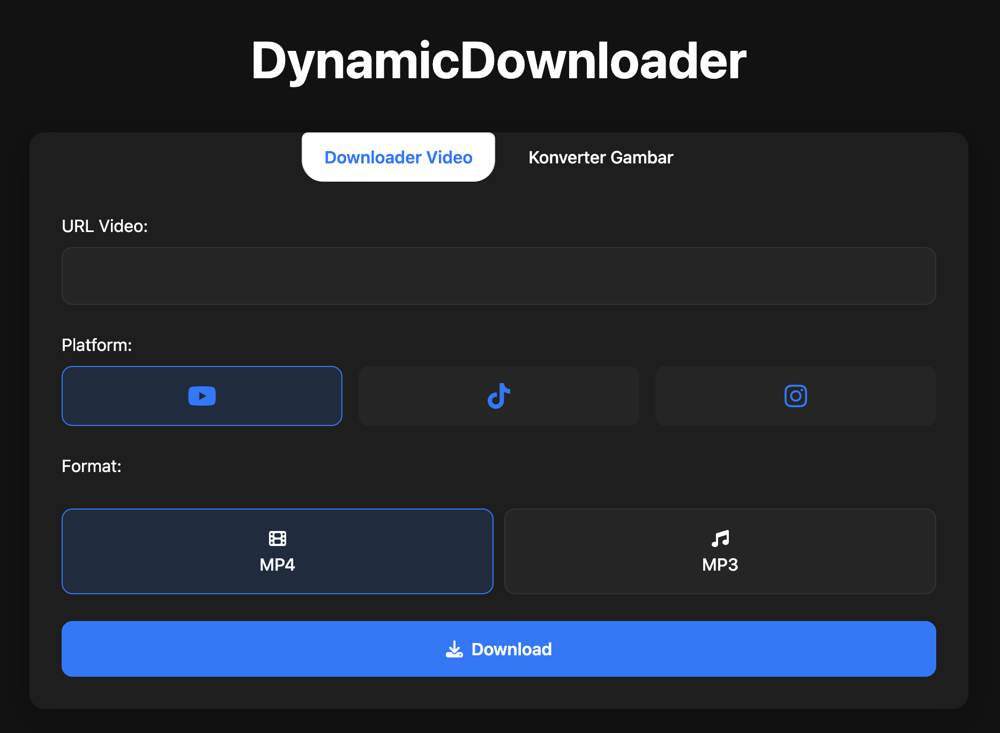

# Video Downloader and Photo Converter.

A simple web application to download videos from YouTube, Instagram, and TikTok. Built with Python Flask and a modern web interface using Tailwind CSS.

## Features

- ✨ Modern and responsive user interface
- 🎥 Supports downloads from:
  - YouTube (MP4 and MP3 formats)
  - Instagram (Reels and Posts)
  - TikTok (Videos)
- 🔍 Automatic platform detection from pasted URLs
- 📁 Quick button to open download folder
- 🎯 Automatic file title cleaning
- 🔒 Runs locally for security (no internet needed to run the application)
- 🖼️ Integrated image converter (including HEIC support for iPhone)

## UI Preview



## Quick Usage Guide

1. Open the application in your browser (http://127.0.0.1:8000)
2. Paste the video URL you want to download
3. The platform will be detected automatically
4. Click the download button
5. Wait for the download process to complete
6. The file will be saved in the "downloads" folder

## System Requirements

For **macOS & Linux** users:
- Python 3.x
- XAMPP or other web server

**Note**: For Windows users, please see [README_WINDOWS.md](README_WINDOWS.md)

## Installation (macOS & Linux)

1. Download or clone this repository:
```bash
git clone https://github.com/bryandanendra/social-media-downloader.git
```

2. Create and activate a virtual environment:
```bash
python -m venv venv
source venv/bin/activate  # For Unix/macOS
```

3. Install all requirements:
```bash
pip install -r requirements.txt
```

4. Run the application:
```bash
python app.py
```

5. Open your browser and access the following address:
```
http://127.0.0.1:8000
```

## Creating a Desktop Application (Optional)

If you want to create an application that can be opened directly without a terminal, follow these steps:

1. Make sure you are in the project directory and the virtual environment is active:
```bash
cd /Applications/XAMPP/xamppfiles/htdocs/social-media-downloader
source venv/bin/activate
```

2. Build the application with PyInstaller:
```bash
pyinstaller app.spec
```

3. Move the build to Applications:
```bash
cp -R "dist/YT Downloader" "/Applications/YT Downloader"
```

4. Run the application from the Applications folder

## Using the Image Converter

This application also has a feature to convert image formats:
1. Click the "Image Converter" menu in the application
2. Upload an image (including HEIC format from iPhone)
3. Select the output format (JPG, PNG, or PDF)
4. Click 'Convert' to change the image format
5. Download the conversion result

### Supported Formats:
- **Input**: HEIC (iPhone), JPG, JPEG, PNG
- **Output**: JPG, PNG, PDF

This conversion feature is especially useful for iPhone users who want to convert HEIC photos to more commonly used formats like JPG, PNG, or PDF.

## Folder Structure

```
social-media-downloader/
├── cache/            # Cache for frequently accessed URLs
├── downloads/        # Folder for downloaded files
├── uploads/          # Folder for uploaded files (image converter)
├── converted/        # Folder for converted images
├── templates/        # HTML templates
├── venv/             # Python virtual environment
├── app.py            # Flask server application
├── run_app.py        # Script to run the desktop application
├── requirements.txt  # Dependency list
└── app.spec          # PyInstaller configuration
```

## Important Notes

- This application runs locally (localhost) for security
- Make sure port 8000 is not used by another application
- Use a virtual environment to isolate dependencies
- The downloads, uploads, and converted folders will be created automatically

## Help & Support

If you experience issues, please:
1. Open an issue in the repository: https://github.com/bryandanendra/social-media-downloader/issues
2. Contact @bryandanendra
3. Run the application through the terminal to see error messages

## License

This project is licensed under the MIT License - see the LICENSE file for details.

## Credits

Created by @bryandanendra 